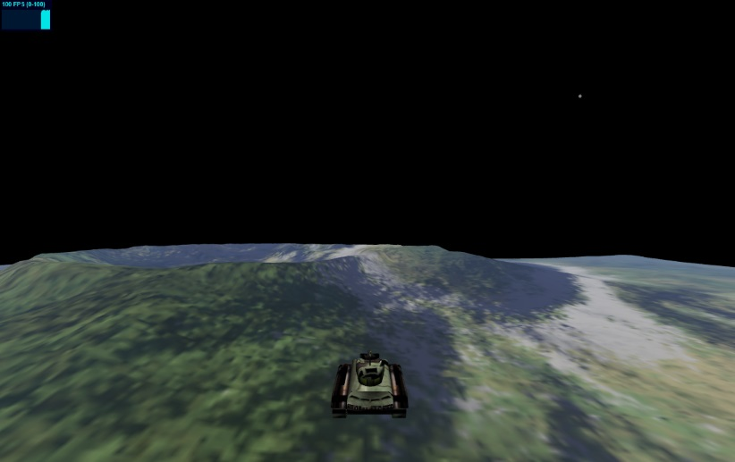

# TankCommand

A Toy project playing around with Typescript &amp; Three.js.
This project has been useful for learning how to integrate Three.js into a TypeScript project.

The VSCode version has been updated to use Vite &amp; Three.js.

